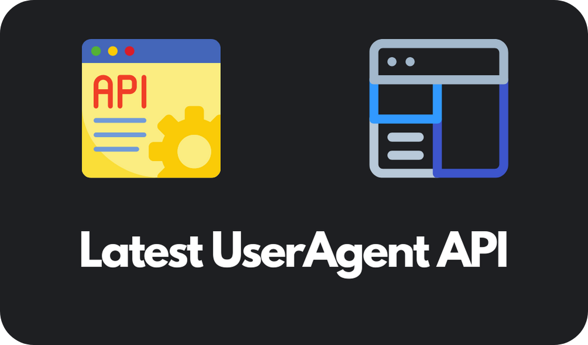

<h1 align="center">Latest User Agent API</h1>

</img>

A (Very Simple) API Which shows the latest user-agents of different devices and browsers

## What is this API for?
I just created this project for fun. Just visit any of the endpoints below and you'll get the latest user-agents of different browsers and devices in `.json` format. You can use it in many places. Suggestions/Issues always welcome. Hope you like my project!  
Note: Thanks a lot to [https://deta.sh](https://deta.sh) for free deployment of my API :D

## Endpoints:
1. All Browsers and devices: [https://useragent.deta.dev/](https://useragent.deta.dev/)
2. Android User Agents - [https://useragent.deta.dev/android](https://useragent.deta.dev/android)

More Endpoints coming soon!

### Other Projects:
MS-Office-Electron - [https://github.com/agam778/MS-Office-Electron](https://github.com/agam778/MS-Office-Electron)

If you like my work, please don't forget to give a "Star" to my repository :)
